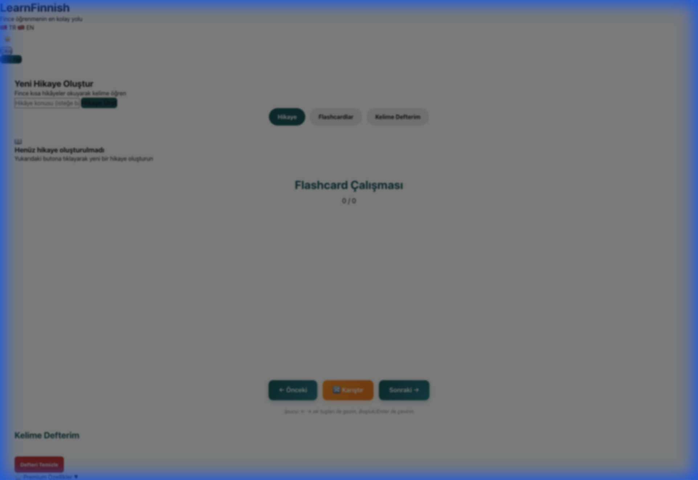
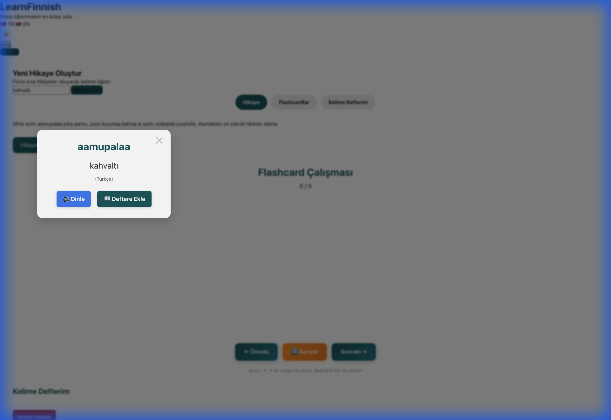
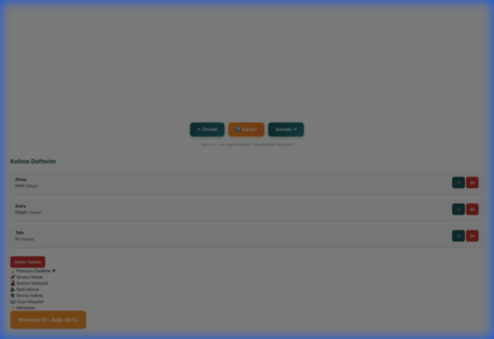
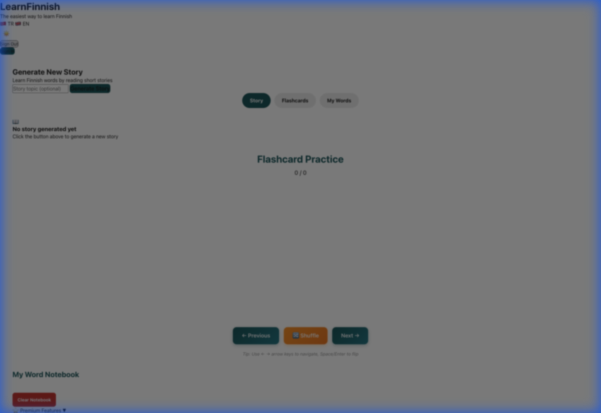
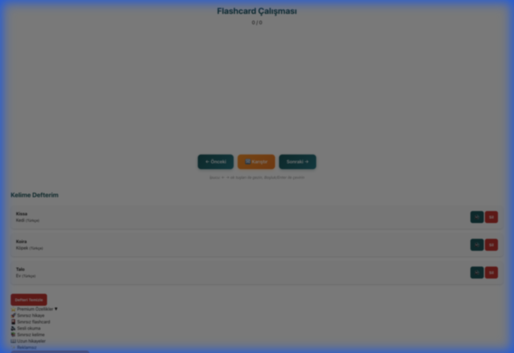
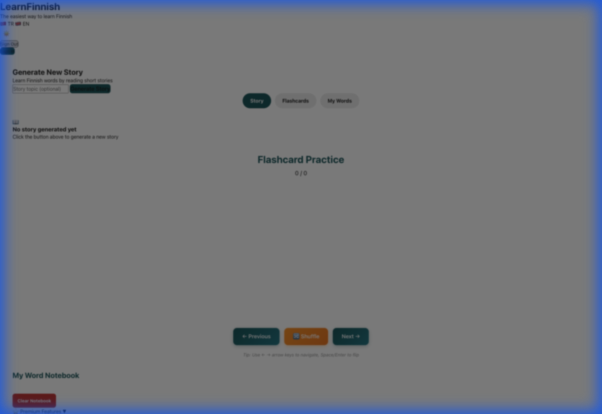

# LearnFinnish - Learn Finnish Through Stories 🇫🇮

Modern, responsive web application for learning Finnish vocabulary through interactive short stories.


## 📸 Screenshots

### Main Interface

*Clean, modern interface with gradient background and story generation controls*

### Interactive Vocabulary Translation

*Click any Finnish word to see instant translation with pronunciation and save options*

### Word Notebook

*Save and manage your learned vocabulary with audio playback*

### Bilingual Support

*Seamless language switching between Turkish and English*

### Premium Features

*Unlock unlimited stories, flashcards, and ad-free experience*

### Mobile Responsive Design

*Fully responsive design optimized for all devices*

## 🌟 Features

### Core Features

- 📚 **AI-Generated Stories** - Create personalized Finnish stories on any topic
- 🔤 **Interactive Vocabulary** - Click any word for instant translation
- 📖 **Word Notebook** - Save and manage your learned vocabulary
- 🌐 **Bilingual Support** - Turkish and English interface
- 📱 **Progressive Web App** - Install and use offline
- 🎨 **Responsive Design** - Optimized for mobile, tablet, and desktop

### Premium Features

- 🔊 **Text-to-Speech** - Listen to stories and words in Finnish
- ♾️ **Unlimited Notebook** - Save unlimited words (free: 50 words)
- 📚 **Extended Stories** - Access longer and more complex stories
- 🚫 **Ad-Free Experience** - Enjoy learning without interruptions

### Authentication & Payment

- 🔐 **Google Sign-In** - Secure authentication with Firebase
- 💳 **Stripe Integration** - Safe and easy premium subscription
- 👤 **User Profiles** - Personalized learning experience

## 🏗️ Architecture

### Professional `/src` Structure

```
/src
├── /assets          # Static assets (images, icons, fonts)
├── /components      # Reusable UI components
│   ├── AuthSection.js
│   ├── LanguageSwitcher.js
│   ├── PremiumCard.js
│   ├── PWAInstall.js
│   ├── StoryDisplay.js
│   └── WordNotebook.js
├── /config          # Configuration files
│   ├── constants.js
│   └── firebase.js
├── /services        # Business logic & API calls
│   ├── api.js
│   ├── auth.js
│   ├── payment.js
│   └── storage.js
├── /styles          # Modular CSS with design system
│   ├── main.css
│   ├── variables.css
│   ├── reset.css
│   ├── responsive.css
│   ├── /components
│   └── /layouts
├── /utils           # Helper functions
│   ├── dom.js
│   └── i18n.js
└── main.js          # Application entry point
```

### Design System

- **Mobile-First**: Responsive breakpoints (640px, 768px, 1024px)
- **CSS Variables**: Centralized design tokens
- **Touch-Friendly**: Minimum 44px touch targets
- **Accessible**: Focus-visible states and semantic HTML

## 🚀 Getting Started

### Prerequisites

- Modern web browser with JavaScript enabled
- Python 3 (for local development server)

### Local Development

1. **Clone the repository**

   ```bash
   git clone https://github.com/yourusername/learnfinnish.git
   cd learnfinnish
   ```

2. **Start local server**

   ```bash
   ./start-server.sh
   # or
   python3 -m http.server 8000
   ```

3. **Open in browser**
   ```
   http://localhost:8000
   ```

### Backend Setup (Optional - for payment features)

Only needed if you want to enable premium subscription features:

```bash
npm install
```

Required environment variables (see [STRIPE_SETUP.md](STRIPE_SETUP.md)):

- `STRIPE_SECRET_KEY`
- `STRIPE_PRICE_ID`
- `STRIPE_WEBHOOK_SECRET`
- `FIREBASE_PROJECT_ID`
- `FIREBASE_CLIENT_EMAIL`
- `FIREBASE_PRIVATE_KEY`

## 📦 Deployment

### Vercel (Recommended)

1. **Connect your repository** to Vercel
2. **Add environment variables** in Vercel dashboard
3. **Deploy** - Automatic deployment on push

The app is configured for Vercel with:

- Serverless API functions in `/api`
- Automatic HTTPS
- CDN distribution
- Environment variable support

## 🛠️ Tech Stack

### Frontend

- **Vanilla JavaScript** (ES6 modules)
- **CSS3** (Custom properties, Grid, Flexbox)
- **Firebase SDK** (Authentication, Firestore)
- **Stripe.js** (Payment processing)

### Backend (Serverless)

- **Vercel Functions** (Node.js)
- **Stripe API** (Subscription management)
- **Firebase Admin SDK** (User management)

### APIs

- **Google Gemini API** - Story generation
- **Google Translate API** - Word translation

## 📱 Progressive Web App

Install LearnFinnish on your device:

- **Mobile**: Tap "Add to Home Screen"
- **Desktop**: Click install icon in address bar
- **Offline**: Access saved stories and notebook

Features:

- Service Worker caching
- Offline functionality
- App-like experience
- Fast loading

## 🎨 Design Highlights

- **Gradient Background** - Soothing blue gradient
- **Card-Based Layout** - Clean, modern interface
- **Smooth Animations** - Micro-interactions for better UX
- **Responsive Typography** - Scales with screen size
- **Touch Optimization** - Perfect for mobile devices

## 📄 License

This project is licensed under the MIT License - see the [LICENCE](LICENCE) file for details.

## 🤝 Contributing

Contributions are welcome! Please feel free to submit a Pull Request.

## 📧 Contact

For questions or feedback, please open an issue on GitHub.

## 🙏 Acknowledgments

- Finnish language learning community
- Google Gemini API for story generation
- Firebase for authentication infrastructure
- Stripe for payment processing

---

**Made with ❤️ for Finnish language learners**
