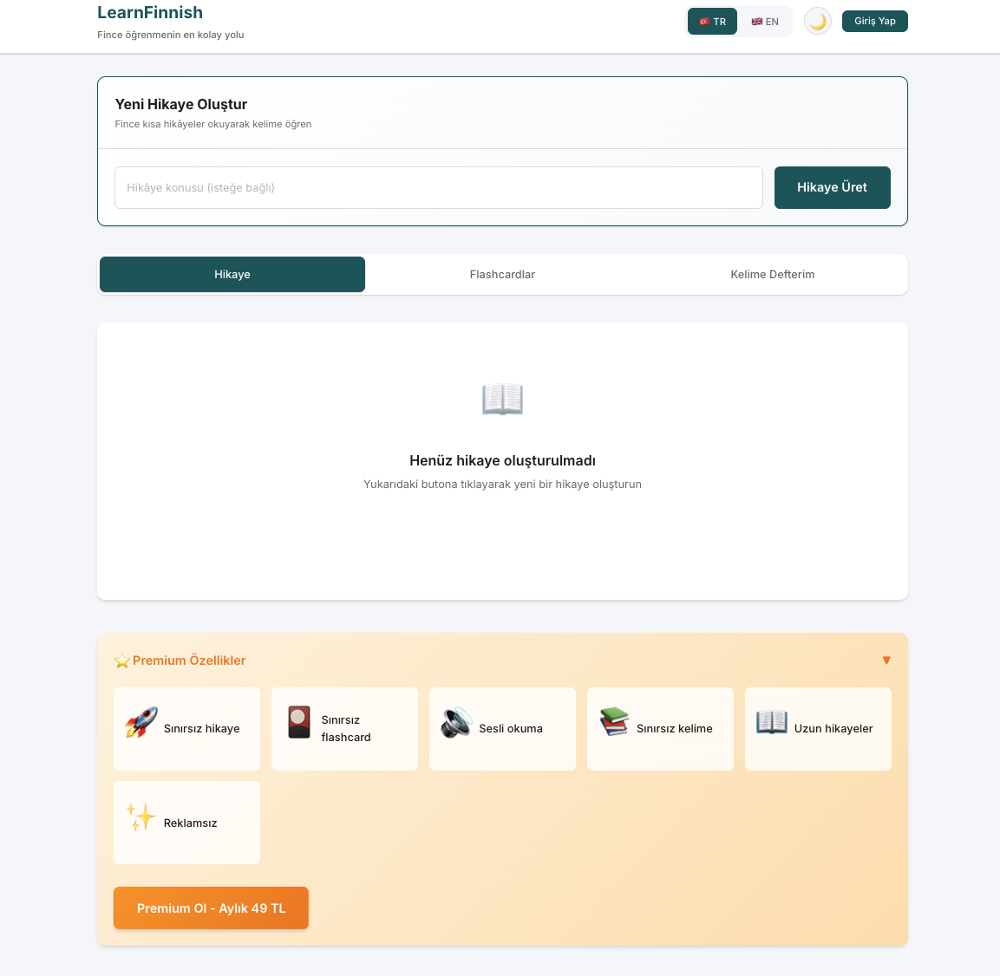
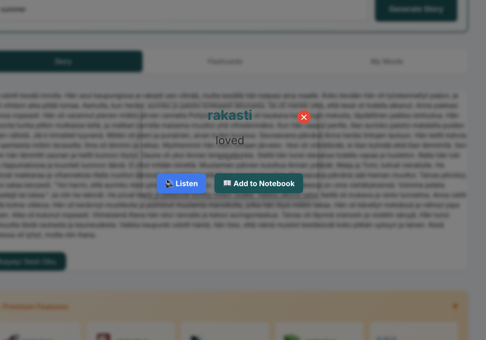
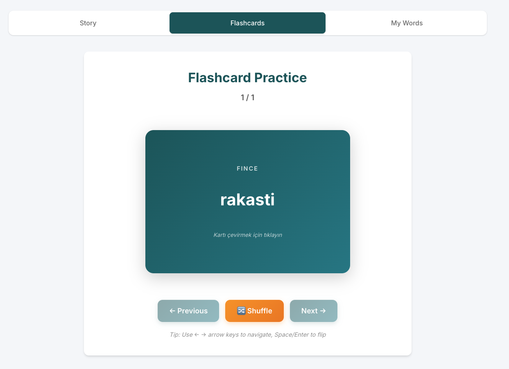
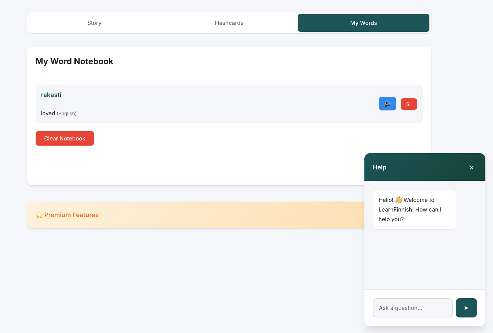

# LearnFinnish - Master Finnish Through Stories 🇫🇮

> **A modern, AI-powered progressive web application designed to help you learn Finnish vocabulary naturally through interactive stories.**


## 🌐 Live Application

- **Official Site**: [https://www.learn-finnish.fi/](https://www.learn-finnish.fi/)
- **Mirror**: [https://learnfinnish.vercel.app](https://learnfinnish.vercel.app)

---

## 🚀 Key Features

### 💎 Premium SaaS Membership
- **Smart Stripe Integration**: Automatically links your Google Login to Stripe payments.
- **Instant Activation**: Premium features (Unlimited stories, TTS) unlock immediately upon payment.
- **Database Persistence**: User premium status is seamlessly synced to Firestore.

### 📚 AI-Powered Story Generation
- **Context-Aware**: Generates unique, B1-level stories (250-500 words) on any topic you choose.
- **Powered by Gemini 1.5 Flash**: Utilizes Google's latest high-performance model for coherent and engaging narratives.
- **Robust Fallback**: Includes a library of locally stored, high-quality stories to ensure availability even if the AI service is busy.

### 🎧 Natural Audio Experience
- **Google TTS Engine**: Ditch the robotic browser voices. We stream high-quality, natural-sounding Finnish audio directly from Google's Text-to-Speech engine.
- **Smart Queue Player**: A custom-built audio player chops long stories into sentences and plays them seamlessly, bypassing standard API character limits.
- **Full Control**: Play, Pause, Resume, and Stop controls for a podcast-like listening experience.

### 🔄 Hybrid Translation System
- **Two-Layer Architecture**:
    1.  **Primary**: Uses **Gemini AI** for context-aware translations (understanding the difference between "kuusi" as *six* vs. *spruce*).
    2.  **Fallback**: Automatically switches to **MyMemory API** if Gemini is unavailable, ensuring you never hit a "Translation Failed" error.
- **Instant Lookup**: Double-click any word in the story to see its meaning instantly.

### 📝 Integrated Learning Tools
- **Gamification**: Earn XP, level up, and maintain streaks.
- **Word Notebook**: Save vocabulary with a single click.
- **Flashcards**: Review your saved words with an interactive flashcard system (Front/Back/Next/Shuffle).
- **Progress Tracking**: Track how many words you've learned.

### 💻 Modern & Accessible
- **Dark Mode**: Fully supported system-wide dark theme.
- **PWA Ready**: Install on your phone or desktop for an app-like experience.
- **SEO Optimized**: Includes a blog with grammar guides and culture tips.

---

## 🛠️ Technology Stack

**Frontend**
- **Core**: Vanilla JavaScript (ES6+), HTML5, CSS3 (Variables, Flexbox/Grid)
- **State Management**: Reactive custom events and LocalStorage
- **Audio**: Custom `GoogleTTSPlayer` class with audio buffering

**Backend (Hybrid Architecture)**
- **Serverless**: Node.js (Vercel Functions) for lightweight deployment.
- **Self-Hosted (Docker)**: Express.js backend containerized for custom servers (e.g., Raspberry Pi 5).
- **Endpoints**:
    - `/api/story`: Orchestrates Gemini 1.5 Flash requests.
    - `/api/translate`: Manages Hybrid Translation logic.
    - `/api/webhook`: Handles Stripe events securely.
    - `/api/tts`: Secure proxy for Google TTS streaming.

**Services**
- **Authentication**: Firebase Auth (Google Sign-In)
- **Database**: Firebase Firestore (User data & Premium status)
- **Payment**: Stripe Integration (Premium subscriptions)
- **Hosting**: Vercel

---

## ❓ Troubleshooting

**App Stuck / Not Updating on Mobile?**
We implemented a **Manual Kill Switch** for aggressive caching issues (common on iOS):
1.  Open the app.
2.  Triple-click quickly on the **"LearnFinnish"** logo in the header.
3.  The app will force-clear all Service Workers and Caches, then reload.

---

## 📸 Screenshots

| **Main Interface** | **Interactive Translation** |
|:---:|:---:|
|  |  |
| *Generate stories & listen naturally* | *Context-aware definitions* |

| **Flashcards** | **Dark Mode** |
|:---:|:---:|
|  |  |
| *Review vocabulary effectively* | *Easy on the eyes* |

---

## 🏗️ Project Structure

```bash
/
├── /api                 # Serverless Backend Functions
│   ├── story.js         # AI Story Generation
│   ├── translate.js     # Hybrid Translation Service
│   └── tts.js           # Audio Proxy
├── /backend             # Self-Hosted Express Backend (Docker/Raspberry Pi)
│   ├── /routes          # API Routes mirroring Vercel functions
│   ├── server.js        # Express Server Entry Point
│   ├── Dockerfile       # Container Configuration
│   └── docker-compose.yml # Orchestration Stack
├── /src
│   ├── /components      # UI Components (Flashcard, StoryDisplay, etc.)
│   ├── /services        # Business Logic (Auth, API, Storage)
│   ├── /utils           # Helpers (DOM manipulation, Audio Player)
│   └── /styles          # Modular CSS Design System
└── /blog                # Static Educational Content
```

---

## 📦 Installation & Setup

1.  **Clone the Repository**
    ```bash
    git clone https://github.com/kapucuonur/LearnFinnish.git
    cd LearnFinnish
    ```

2.  **Install Dependencies** (for local dev tools)
    ```bash
    npm install
    ```

3.  **Environment Variables**
    Create a `.env` file with the following keys:
    ```env
    GEMINI_API_KEY=your_gemini_key
    FIREBASE_CONFIG=your_firebase_config
    STRIPE_SECRET_KEY=your_stripe_key
    ```

4.  **Run Locally (Frontend)**
    ```bash
    npm start
    # or
    python3 -m http.server 3000
    ```

5.  **Run Backend Locally (Docker via Pi/Server)**
    ```bash
    cd backend
    docker-compose up -d --build
    ```
    *The Express API will be accessible on `http://localhost:4000`.*

---

## 📄 License

This project is open-source and available under the [MIT License](LICENSE).

---

**Made with ❤️ for Finnish Learners**
